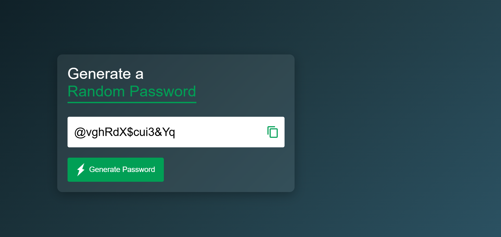

<h1 align="center">
   
  Random Password Generator 
</h1>

<p align="center">
A clean and modern Random Password Generator built using HTML, CSS, and JavaScript.It generates secure passwords instantly and allows users to copy them with one click.

</p>

<p align="center">
  
  
  
  
</p>

---

## 📑 Table of Contents

- [🚀 Live Demo](#-live-demo)
- [🚀 Project Preview](#-project-preview)
- [📌 About The Project](#-about-the-project)
- [✨ Features](#-features)
- [⚙️ How It Works](#️-how-it-works)
- [📂 Project Structure](#-project-structure)
- [🏗️ Installation](#️-installation--setup)
- [🛠 Technologies Used](#-technologies-used)
- [📜 License](#-license)
- [👨‍💻 Author](#-author)

---

## 🚀 Live Demo

👉 **Direct Link:** https://arnav-sirkhal.github.io/random-password-generator-js/

---

## 🚀 Project Preview

<p align="center">
  
</p>

---

## 📌 About The Project

This project generates a 15-character strong password using:

- Uppercase letters
- Lowercase letters
- Numbers
- Symbols

It uses JavaScript's `Math.random()` method to create random combinations securely.

The project also includes:

- Smooth UI
- Copy to clipboard feature
- Clean modern design
- Responsive layout

---

## ✨ Features

✅ Generates random 15-character passwords  
✅ Uses uppercase, lowercase, numbers, and symbols  
✅ One-click copy functionality  
✅ Simple and clean user interface  
✅ Fully responsive

---

## ⚙️ How It Works

1. All characters (uppercase, lowercase, numbers, symbols) are combined into one string.
2. A loop runs until the desired password length is reached.
3. Random characters are selected using:

```javascript
Math.floor(Math.random() * allChars.length);
```

4. The password is displayed in the input field.
5. The clipboard API copies the password when the copy icon is clicked.

---

## 📂 Project Structure

```
random-password-generator-js/
│
├── images/
│   ├── copy.png
│   ├── generate.png
│   └── screenshot.png
│
├── index.html
├── style.css
├── script.js
├── LICENSE
└── README.md

```

---

## 💻 Installation & Setup

1️⃣ Clone the repository:

```bash
git clone https://github.com/Arnav-Sirkhal/random-password-generator-js.git
```

2️⃣ Open the project folder.

3️⃣ Run `index.html` in your browser.

---

## 🛠 Technologies Used

- HTML5
- CSS3
- JavaScript (ES6)
- Clipboard API

---

## 📜 License

This project is licensed under the MIT License.  
https://opensource.org/licenses/MIT

---

## 👨‍💻 Author

**Arnav Sirkhal**

GitHub: https://github.com/Arnav-Sirkhal

---

<p align="center">
  ⭐ If you like this project, consider starring the repository!
</p>
